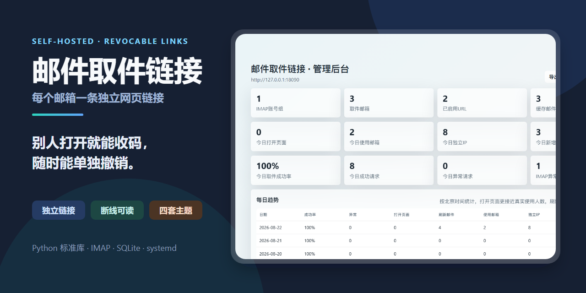
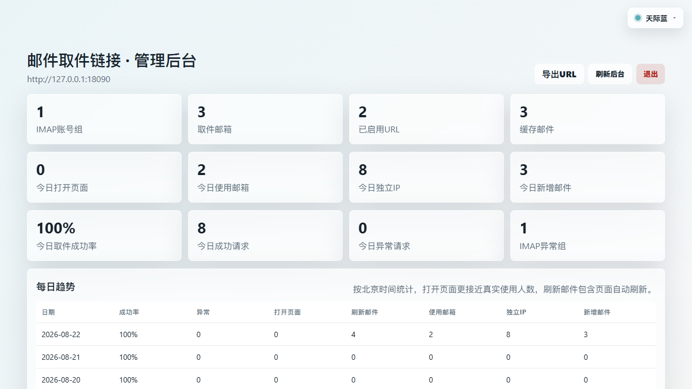
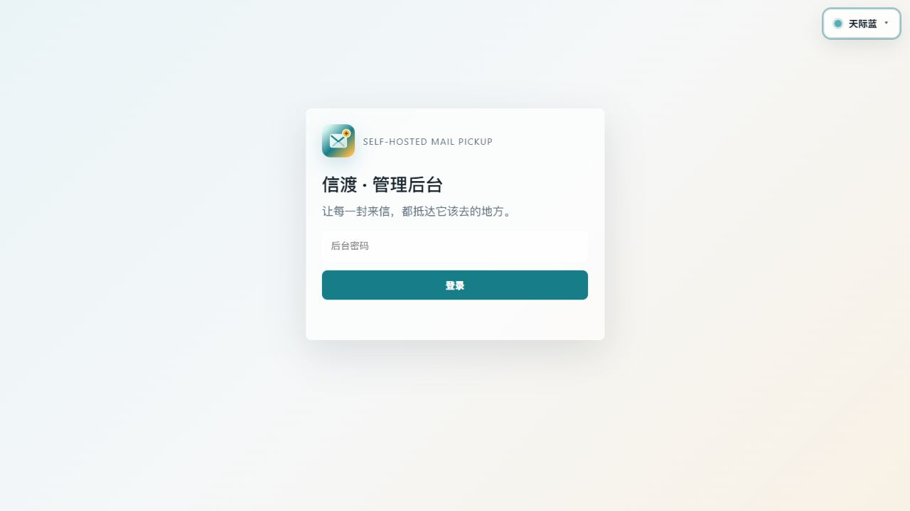

# 邮件取件链接

中文 · [English](README_EN.md)

[](https://github.com/ferretgeek/imap-pickup-links/actions/workflows/ci.yml)
[](https://github.com/ferretgeek/imap-pickup-links/actions/workflows/codeql.yml)
[](https://www.python.org/)
[](#三分钟跑起来)
[](LICENSE)

> 给每个邮箱生成一条独立的网页链接，对方打开就能收验证码——不用交出邮箱密码。

## 为什么会需要它

有时候你需要让别人（同事、家人、临时协作者）拿到某个邮箱里的验证码。可选项通常只有两个：把邮箱密码给他，或者你自己盯着邮箱当人工转发器。

两个都不好。第一个交出了整个邮箱，第二个占用你的时间。

这个工具给出第三个选项：**为每个收件邮箱生成一条密码学随机的网页链接。** 打开链接的人只能看到那一个邮箱的最近邮件和验证码，看不到别的邮箱，也拿不到密码。链接可以随时单独停用或重置。

服务跑在你自己的电脑或服务器上，运行时**只依赖 Python 标准库**。

## 界面





## 它能做什么

- **独立取件链接** — 每个收件邮箱一条密码学随机 URL，可单独停用或重置，互不影响。
- **只读，而且断线也能用** — 按所属 IMAP 账号组隔离查询；上游临时断线时仍可读取缓存内容。
- **完整管理后台** — 邮箱组检查、URL 管理、访问统计、分页与搜索，全部在浏览器里完成。
- **四套全局主题** — 天际蓝、青岚绿、霞光橙和深灰夜色，右上角切换并自动记住。
- **默认安全** — 只监听 `127.0.0.1`；后台密码从标准输入读取（不进命令行历史）；外部 IP 归属地查询默认关闭。
- **本地和服务器都能跑** — Windows / macOS / Linux 本地运行，也能在 Linux 上用 systemd 长期托管。

## 三分钟跑起来

需要 Python 3.10+ 和 SQLite 3.35+。没有第三方运行依赖。

```powershell
python --version
python pickup_server/app.py init --admin-password-stdin --base-url "http://127.0.0.1:8080"
python pickup_server/app.py serve
```

第一条命令会从终端安全读取后台密码，并生成仅供本机使用的 `.env` 与 SQLite 数据库。然后访问：

- 管理后台：`http://127.0.0.1:8080/admin`
- 健康检查：`http://127.0.0.1:8080/health`
- 就绪检查：`http://127.0.0.1:8080/ready`

默认**不能**从局域网或公网访问。确需局域网直连时才显式加 `--host 0.0.0.0` 并配好防火墙；公网部署推荐保持 `127.0.0.1`，由 Caddy 或 Nginx 提供 HTTPS。

## 导入邮箱

把 `examples/待导入邮箱/示例账号组.txt` 复制到一个**不进 Git** 的私有目录。每个 TXT 文件代表一个主邮箱账号组：

```text
owner@example.com----应用专用密码
pickup-one@example.com
pickup-two@example.com
```

然后导入并生成 URL：

```powershell
python pickup_server/app.py import --source "私有邮箱文件夹" --base-url "http://127.0.0.1:8080" --output "output/取件URL.txt"
python pickup_server/app.py audit-urls --input "output/取件URL.txt"
```

`audit-urls` 只报告格式、重复和数量，**不回显邮箱或 token**。

## 取件 API

```text
GET /api/q/<token>/messages?wait=5&limit=30
```

- `fetch.pending=true` 时，按 `Retry-After` 或 `fetch.retry_after_seconds` 稍后重试。
- `fetch.state=degraded` 表示本轮刷新失败，但已有缓存仍可读。
- 请用每封邮件的稳定 `id` 去重。

## 技术上值得一提的地方

**降级读取是刻意设计的。** IMAP 上游会抽风。此时接口不会直接报错，而是返回 `fetch.state=degraded` 加上已有缓存——**并且明确告诉你这是降级状态**。取件的人能拿到十分钟前那封验证码，同时知道数据不是最新的，这比一个 500 有用得多。

**查询按账号组隔离。** 一个取件 token 只能触及它所属的 IMAP 账号组，跨组查询在数据层就被切断，不依赖界面上的过滤。

**密码从标准输入读。** `--admin-password-stdin` 让密码不进命令行参数，也就不进 shell 历史、`ps` 输出和 systemd 日志。

**IP 归属地默认关闭。** 只有部署者显式设置 `PICKUP_ENABLE_IP_GEO=1` 时，访问者 IP 才会被发送到受限的 HTTPS 服务（`ipwho.is` 或 `ipapi.co`）并缓存。不需要就别开——**默认不把访客 IP 交给第三方。**

**长轮询而不是轮询。** `wait` 参数让调用方挂着等新邮件，而不是每秒来一次。

**纯标准库。** 服务、后台、缓存、统计全用 Python 标准库实现，部署时不需要处理任何依赖冲突。

完整服务器部署、更新与回滚步骤见[部署说明](docs/部署说明.md)，API 与数据模型见[技术说明](docs/技术说明.md)。

## 它不做什么

- 不发信、不删信、不改动邮箱里的任何内容（只读）。
- 不接受也不存储你的邮箱主密码——请使用应用专用密码。
- 不提供公网默认入口（要自己配 HTTPS 反代）。
- 不做垃圾邮件过滤或邮件客户端功能。

## 隐私边界

运行时会保存邮箱配置、应用专用密码、取件 token、邮件缓存和访问统计。以下内容**永远不应提交或公开**：

```text
pickup_server/.env
pickup_server/data/
output/
真实邮箱导入文件
```

公开仓库经过源码、历史、文档、图片与元数据扫描，但部署者仍须保护运行时目录并使用 HTTPS。发现安全问题请按 [SECURITY.md](SECURITY.md) 私下报告。

## 验证

```powershell
python -m compileall -q pickup_server tests
python -m unittest discover -s tests -v
```

发布审计与工具结论记录在 [docs/发布审计.md](docs/发布审计.md)。

## 更多文档

[部署说明](docs/部署说明.md) · [技术说明](docs/技术说明.md) · [版本变更](CHANGELOG.md) · [参与开发](CONTRIBUTING.md) · [安全策略](SECURITY.md)

## 许可

[MIT](LICENSE)
